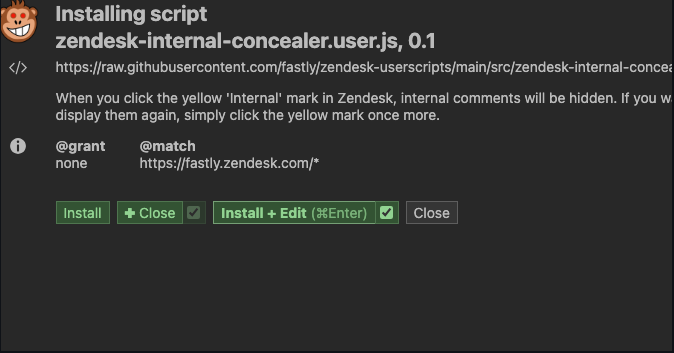

# OriginalGrafanaAlert

# Explanation 

This tool is not ideal for Grafana Alerting.
In my case, I was unable to enable Grafana Alert due to budget constraints, so I built this tool to detect abnormal spikes.

# Architecture 

I have created two Grafana panels for a single graph:
one for visibility and the other for alerting purposes.

This Violentmonkey script monitors the Grafana page every minute.
When a string that starts with 'ALERT', like the example below, appears in an alerting panel, the script captures it and sends the trailing substrings, split by '_', to your Slack channel."

```
ALERT_2025-02-25-16:53_187.938_NRT_P50_TTFB_1500ms_MISSPASS_test
```

Therefore, auto-refresh in Grafana should be enabled.

# Demonstration 


# This tool used VioloentMonkey and You need to install it on your Browser as an extetntion. 

## For User 
1. Install Violentmonkey

https://chromewebstore.google.com/detail/violentmonkey/jinjaccalgkegednnccohejagnlnfdag?hl=en-US&utm_source=ext_sidebar

2. Download userscripts and install them as initial set up.
   
   A. Click the URL
 - Fastly-addon on zendesk -> https://github.com/fastly/zendesk-userscripts/raw/main/src/fastly-addon.user.js
 - Zendesk-InternalComment-concealer -> https://github.com/fastly/zendesk-userscripts/raw/main/src/zendesk-internal-concealer.user.js
   
   B. Click "Install + Edit"

   


## For Developer 
You can edit scripts on Violentmonkey extention tool. However, whenever I update the script and debug, I have to copy it to Git repo. 
It will be tedious. So I prefer tracking userscripts between Violentmonkey extention and local Git repo. 


1. Clone this repo

2. Open chrome://extensions in Chrome 

3. Choose Violentmonkey

4. Enable "Allow access to file URLs"

5. Open a Userscript on Chrome and VSCode and then click "Track external edits". 

```
open -a "Google Chrome" $HOME/zendesk-userscripts/src/copylink.user.js && code $HOME/zendesk-userscripts/src/copylink.user.js
```

6. Edit the Userscript on VSCode.


FYI : 

Set up userscript repo. 

Settings > Pages > Source > Choose "Branch" > Grab a Domain name like "https://probable-barnacle-z4jp4k8.pages.github.io/" 

(2) 
VSCode tip : 
Useful extention : 
https://marketplace.visualstudio.com/items?itemName=ms-vscode.vscode-typescript-next
